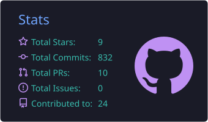
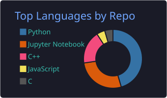
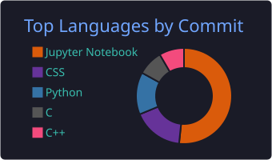

<!-- # Juneyong 😉 -->

<h3 align="center">📊 GitHub Stats 📊</h3>

<!-- 
 -->

<h3 align="center">💪 Tech Stack 💪</h3>

<table>
  <tr>
    <td valign="top" width="55%">
      <h3>Platforms &amp; Languages</h3>
      
      <h3>Tools</h3>
      
    </td>
    <td valign="middle" width="45%" align="center">
       
       
      
    </td>
  </tr>
</table>

 
<!--  
 -->

# :mailbox_with_mail: Contacts

Here are some ideas to get you started:

- 🔭 I will work for Artificial Intelligence Research Institute
- 🌱 I’m currently learning Deep Learning, Computer Vision, Generative models, Multi-modal AI
- 👯 I’m looking to collaborate on ...
- 🤔 I want to learn from someone who knows travel in Japan well.
- 💬 Ask me about ...
- 📫 How to reach me: diziyong@hufs.ac.kr, diziyong1523@gmail.com
- 😄 Hobby: bowling, Table tennis, Studio Ghibli animation 
- ⚡ Fun fact: ...

## 🐍 잔디 스네이크

<picture>
  <source media="(prefers-color-scheme: dark)" srcset="https://raw.githubusercontent.com/yousirong/yousirong/output/github-snake-dark.svg" />
  <source media="(prefers-color-scheme: light)" srcset="https://raw.githubusercontent.com/yousirong/yousirong/output/github-snake.svg" />
  
</picture>

